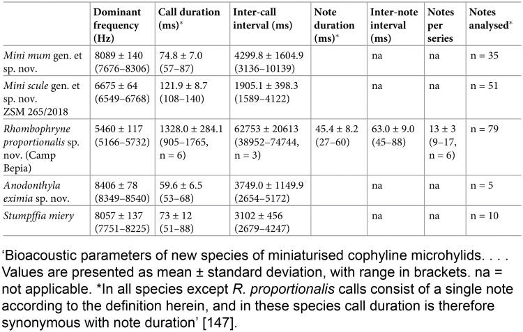
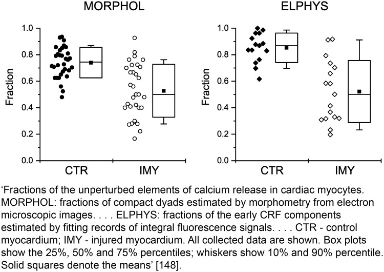

## What to write

For each experiment conducted, including independent replications, report a summary/descriptive statistics for each experimental group, with a measure of variability where applicable (e.g., mean and SD, or median and range).

## Explanation

Summary/descriptive statistics provide a quick and
simple description of the data; they communicate quantitative results
easily and facilitate visual presentation. For continuous data, these
descriptors include a measure of central tendency (e.g., mean, median)
and a measure of variability (e.g., quartiles, range, standard
deviation) to help readers assess the precision of the data collected.
Categorical data can be expressed as counts, frequencies, or
proportions.

Report data for all experiments conducted. If a complete experiment is
repeated on a different day or under different conditions, report the
results of all repeats rather than selecting data from representative
experiments. Report the exact number of experimental units per group so
readers can gauge the reliability of the results (see Item 2. Sample
size and Item 3. Inclusion and exclusion criteria). Present data clearly
as text, in tables, or in graphs, to enable information to be evaluated
or extracted for future meta-analyses [@pbio.3000411.ref146]. Report
descriptive statistics with a clearly identified measure of variability
for each group. @fig-5 shows data
summarised as means and standard deviations and, in brackets, ranges.
Box plots are a convenient way to summarise continuous data, plotted as
median and interquartile range, as shown in @fig-6.

## Examples

{#fig-5}

{#fig-6}
