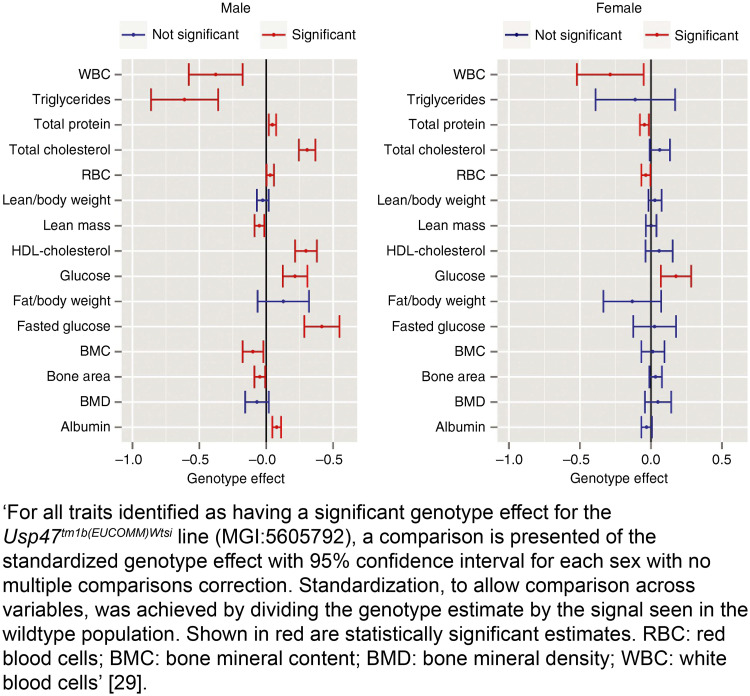

For each experiment conducted, including independent replications, report the effect size with a confidence interval, if applicable.

## Explanation

In hypothesis-testing studies using inferential
statistics, investigators frequently confuse statistical significance
and small *p*-values with biological or clinical importance
[@pbio.3000411.ref149]. Statistical significance is usually
quantified and evaluated against a preassigned threshold, with *p* \<
0.05 often used as a convention. However, statistical significance is
heavily influenced by sample size and variation in the data (see Item 2.
Sample size). Investigators must consider the size of the effect that
was observed and whether this is a biologically relevant change.

Effect sizes are often not reported in animal research, but they are
relevant to both exploratory and hypothesis-testing studies. An effect
size is a quantitative measure that estimates the magnitude of
differences between groups or strength of relationships between
variables. It can be used to assess the patterns in the data collected
and make inferences about the wider population from which the sample
came. The confidence interval for the effect indicates how precisely the
effect has been estimated and tells the reader about the strength of the
effect [@pbio.3000411.ref150]. In studies in which statistical power
is low and/or hypothesis-testing is inappropriate, providing the effect
size and confidence interval indicates how small or large an effect
might really be, so a reader can judge the biological significance of
the data [@pbio.3000411.ref151; @pbio.3000411.ref152]. Reporting
effect sizes with confidence intervals also facilitates extraction of
useful data for systematic review and meta-analysis. When multiple
independent studies included in a meta-analysis show quantitatively
similar effects, even if each is statistically nonsignificant, this
provides powerful evidence that a relationship is 'real', although
small.

Report all analyses performed, even those providing non-statistically
significant results. Report the effect size to indicate the size of the
difference between groups in the study, with a confidence interval to
indicate the precision of the effect size estimate.

**Example**

