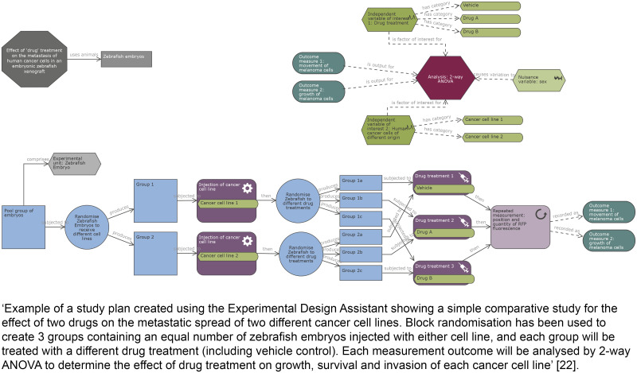

## What to write

For each experiment, describe the groups being compared, including control groups.

If you did not use a control group, explain why.

## Explanation

The choice of control or comparator group is dependent
on the experimental objective. Negative controls are used to determine
whether a difference between groups is caused by the intervention (e.g.,
wild-type animals versus genetically modified animals, placebo versus
active treatment, sham surgery versus surgical intervention). Positive
controls can be used to support the interpretation of negative results
or determine if an expected effect is detectable.

It may not be necessary to include a separate control with no active
treatment if, for example, the experiment aims to compare a treatment
administered by different methods (e.g., intraperitoneal administration
versus oral gavage) or animals that are used as their own control in a
longitudinal study. A pilot study, such as one designed to test the
feasibility of a procedure, might also not require a control group.

For complex study designs, a visual representation is more easily
interpreted than a text description, so a timeline diagram or flowchart
is recommended. Diagrams facilitate the identification of which
treatments and procedures were applied to specific animals or groups of
animals and at what point in the study these were performed. They also
help to communicate complex design features such as whether factors are
crossed or nested (hierarchical/multilevel designs), blocking (to reduce
unwanted variation, see Item 4. Randomisation), or repeated measurements
over time on the same experimental unit (repeated measures designs); see
[@pbio.3000411.ref016-@pbio.3000411.ref018] for more information
on different design types. The Experimental Design Assistant (EDA) is a
platform to support researchers in the design of in vivo experiments; it
can be used to generate diagrams to represent any type of experimental
design [@pbio.3000411.ref019].

For each experiment performed, clearly report all groups used.
Selectively excluding some experimental groups (for example, because the
data are inconsistent or conflict with the narrative of the paper) is
misleading and should be avoided [@pbio.3000411.ref020]. Ensure that
test groups, comparators, and controls (negative or positive) can be
identified easily. State clearly if the same control group was used for
multiple experiments or if no control group was used.

## Examples

> 'The DAV1 study is a one-way, two-period crossover trial with 16 piglets
receiving amoxicillin and placebo at period 1 and only amoxicillin at
period 2. Amoxicillin was administered orally with a single dose of 30
mg.kg^-1^. Plasma amoxicillin concentrations were collected at same
sampling times at each period: 0.5, 1, 1.5, 2, 4, 6, 8, 10 and 12 h'
[@pbio.3000411.ref021].

> 
