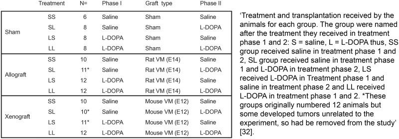

## What to write

Specify the exact number of experimental units allocated to each group, and the total number in each experiment.  

Indicate the total number of animals used.

## Explanation

The sample size relates to the number of experimental
units in each group at the start of the study and is usually represented
by *n* (see Item 1. Study design for further guidance on identifying and
reporting experimental units). This information is crucial to assess the
validity of the statistical model and the robustness of the experimental
results.

The sample size in each group at the start of the study may be different
from the *n* numbers in the analysis (see Item 3. Inclusion and
exclusion criteria); this information helps readers identify attrition
or if there have been exclusions and in which group they occurred.
Reporting the total number of animals used in the study is also useful
to identify whether any were reused between experiments.

Report the exact value of *n* per group and the total number in each
experiment (including any independent replications). If the experimental
unit is not the animal, also report the total number of animals to help
readers understand the study design. For example, in a study
investigating diet using cages of animals housed in pairs, the number of
animals is double the number of experimental units.

## Example

