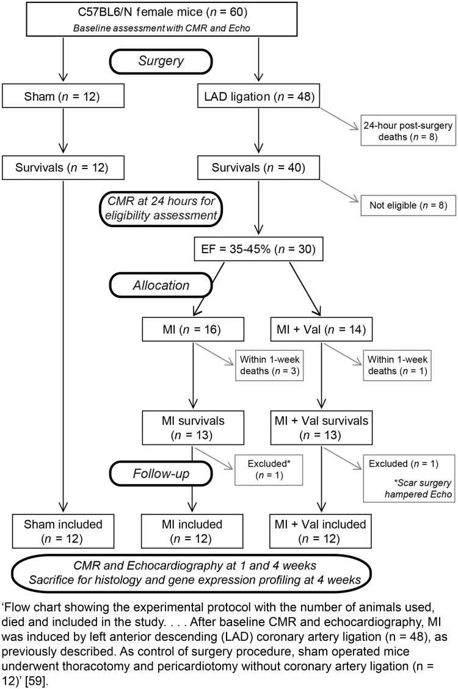

## What to write

For each experimental group, report any animals, experimental
units, or data points not included in the analysis and explain why.

If there were no exclusions, state so.

## Explanation

Animals, experimental units, or data points that are
unaccounted for can lead to instances in which conclusions cannot be
supported by the raw data [@pbio.3000411.ref052]. Reporting
exclusions and attritions provides valuable information to other
investigators evaluating the results or who intend to repeat the
experiment or test the intervention in other species. It may also
provide important safety information for human trials (e.g., exclusions
related to adverse effects).

There are many legitimate reasons for experimental attrition, some of
which are anticipated and controlled for in advance (see subitem 3a on
defining exclusion and inclusion criteria), but some data loss might not
be anticipated. For example, data points may be excluded from analyses
because of an animal receiving the wrong treatment, unexpected drug
toxicity, infections or diseases unrelated to the experiment, sampling
errors (e.g., a malfunctioning assay that produced a spurious result,
inadequate calibration of equipment), or other human error (e.g.,
forgetting to switch on equipment for a recording).

Most statistical analysis methods are extremely sensitive to outliers
and missing data. In some instances, it may be scientifically
justifiable to remove outlying data points from an analysis, such as
obvious errors in data entry or measurement with readings that are
outside a plausible range. Inappropriate data cleaning has the potential
to bias study outcomes [@pbio.3000411.ref053]; providing the
reasoning for removing data points enables the distinction to be made
between responsible data cleaning and data manipulation. Missing data,
common in all areas of research, can impact the sensitivity of the study
and also lead to biased estimates, distorted power, and loss of
information if the missing values are not random
[@pbio.3000411.ref054]. Analysis plans should include methods to
explore why data are missing. It is also important to consider and
justify analysis methods that account for missing data
[@pbio.3000411.ref055; @pbio.3000411.ref056].

There is a movement toward greater data sharing (see Item 20. Data
access), along with an increase in strategies such as code sharing to
enable analysis replication. These practices, however transparent, still
need to be accompanied by a disclosure on the reasoning for data
cleaning and whether methods were defined before any data were
collected.

Report all animal exclusions and loss of data points, along with the
rationale for their exclusion. For example, this information can be
summarised as a table or a flowchart describing attrition in each
treatment group. Accompanying this information should be an explicit
description of whether researchers were blinded to the group allocations
when data or animals were excluded (see Item 5. Blinding and
[@pbio.3000411.ref057]). Explicitly state when built-in models in
statistics packages have been used to remove outliers (e.g., GraphPad
Prism's outlier test).

## Examples

> 'Pen was the experimental unit for all data. One entire pen (ZnAA90) was
removed as an outlier from both Pre-RAC and RAC periods for poor
performance caused by illness unrelated to treatment.... Outliers were
determined using Cook's D statistic and removed if Cook's D \> 0.5. One
steer was determined to be an outlier for day 48 liver biopsy TM and
data were removed' [@pbio.3000411.ref058].

> 'Seventy-two SHRs were randomized into the study, of which 13 did not
meet our inclusion and exclusion criteria because the drop in cerebral
blood flow at occlusion did not reach 60% (seven animals), postoperative
death (one animal: autopsy unable to identify the cause of death),
haemorrhage during thread insertion (one animal), and disconnection of
the silicon tip of the thread during withdrawal, making the permanence
of reperfusion uncertain (four animals). A total of 59 animals were
therefore included in the analysis of infarct volume in this study. In
error, three animals were sacrificed before their final assessment of
neurobehavioral score: one from the normothermia/water group and two
from the hypothermia/pethidine group. These errors occurred blinded to
treatment group allocation. A total of 56 animals were therefore
included in the analysis of neurobehavioral score'
[@pbio.3000411.ref051].

> 
