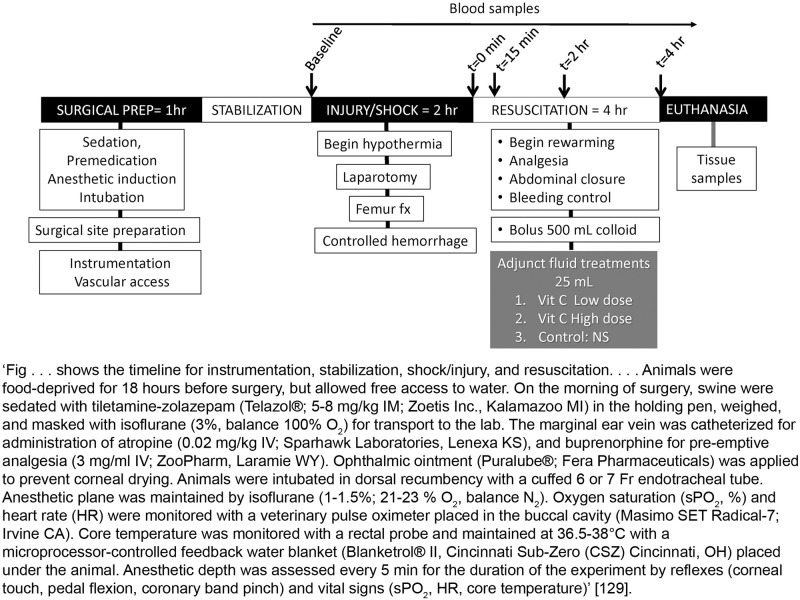

## What to write

For each experimental group, including controls, describe **what was done, how it was done, and what was used**.

## Explanation

Essential information to describe in the manuscript
includes the procedures used to develop the model (e.g., induction of
the pathology), the procedures used to measure the outcomes, and pre-
and postexperimental procedures, including animal handling, welfare
monitoring, and euthanasia. Animal handling can be a source of stress,
and the specific method used (e.g., mice picked up by tail or in cupped
hands) can affect research outcomes
[@pbio.3000411.ref061; @pbio.3000411.ref121; @pbio.3000411.ref122].
Details about animal care and monitoring intrinsic to the procedure are
discussed in further detail in Item 16. Animal care and monitoring.
Provide enough detail to enable others to replicate the methods and
highlight any quality assurance and quality control used
[@pbio.3000411.ref123; @pbio.3000411.ref124]. A schematic of the
experimental procedures with a timeline can give a clear overview of how
the study was conducted. Information relevant to distinct types of
interventions and resources are described in @tbl-info.

+----------------------------------+----------------------------------+
| Procedures                       | Resources                        |
+:=================================+:=================================+
| [Pharmacological procedures      | [Cell lines]{.underline}         |
| (intervention and                |                                  |
| control)]{.underline}            | -   Identification               |
|                                  |                                  |
| -   Drug formulation             | -   Provenance                   |
|                                  |                                  |
| -   Dose                         | -   Verification and             |
|                                  |     authentication               |
| -   Volume                       |                                  |
|                                  | -   RRID                         |
| -   Concentration                |     [@pbio.3000411.ref126]     |
|                                  | ,[@pbio.3000411.ref127]        |
| -   Site and route of            |                                  |
|     administration               |                                  |
|                                  |                                  |
| -   Frequency of administration  |                                  |
|                                  |                                  |
| -   Vehicle or carrier solution  |                                  |
|     formulation and volume       |                                  |
|                                  |                                  |
| -   Any evidence that the        |                                  |
|     pharmacological agent used   |                                  |
|     reaches the target tissue    |                                  |
+----------------------------------+----------------------------------+
| [Surgical procedures (including  | [Reagents (e.g., antibodies,     |
| sham surgery)]{.underline}       | chemicals)]{.underline}          |
|                                  |                                  |
| -   Description of the surgical  | -   Manufacturer                 |
|     procedure                    |                                  |
|                                  | -   Supplier                     |
| -   Anaesthetic used (including  |                                  |
|     dose and other information   | -   Catalogue number             |
|     listed in pharmacological    |                                  |
|     procedures section above)    | -   Lot number (if applicable)   |
|                                  |                                  |
| -   Pre- and postanalgesia       | -   Purity of the drug (if       |
|     regimen                      |     applicable)                  |
|                                  |                                  |
| -   Presurgery procedures (e.g., | -   RRID                         |
|     fasting)                     |                                  |
|                                  |                                  |
| -   Aseptic techniques           |                                  |
|                                  |                                  |
| -   Monitoring (e.g., assessment |                                  |
|     of surgical anaesthetic      |                                  |
|     plane)                       |                                  |
|                                  |                                  |
| -   Whether the procedure is     |                                  |
|     terminal or not              |                                  |
|                                  |                                  |
| -   Postsurgery procedures       |                                  |
|                                  |                                  |
| -   Duration of the procedure    |                                  |
|     and duration of anaesthesia  |                                  |
|                                  |                                  |
| -   Physical variables measured  |                                  |
+----------------------------------+----------------------------------+
| [Pathogen infection              | [Equipment and                   |
| (intervention and                | software]{.underline}            |
| control)]{.underline}            |                                  |
|                                  | -   Manufacturer                 |
| -   Infectious agent             |                                  |
|                                  | -   Supplier                     |
| -   Dose load                    |                                  |
|                                  | -   Model/version number         |
| -   Vehicle or carrier solution  |                                  |
|     formulation and volume       | -   Calibration procedures (if   |
|                                  |     applicable)                  |
| -   Site and route of infection  |                                  |
|                                  | -   RRID                         |
| -   Timing or frequency of       |                                  |
|     infection                    |                                  |
+----------------------------------+----------------------------------+
| [Euthanasia]{.underline}         |                                  |
|                                  |                                  |
| -   Method of euthanasia,        |                                  |
|     including the humane         |                                  |
|     standards the method         |                                  |
|     complies with, such as the   |                                  |
|     AVMA                         |                                  |
|     [@pbio.3000411.ref125]       |                                  |
|                                  |                                  |
| -   Pharmacological agent, if    |                                  |
|     used (including dose and     |                                  |
|     information listed in        |                                  |
|     pharmacological procedures   |                                  |
|     section above)               |                                  |
|                                  |                                  |
| -   Any measures taken to reduce |                                  |
|     pain and distress before or  |                                  |
|     during euthanasia            |                                  |
|                                  |                                  |
| -   Timing of euthanasia         |                                  |
|                                  |                                  |
| -   Tissues collected            |                                  |
|     post-euthanasia and timing   |                                  |
|     of collection                |                                  |
+----------------------------------+----------------------------------+

: Examples of information to include when reporting specific types of experimental procedures and resources. AVMA, American Veterinary Medical Association; RRID, Research Resource Identifier. {#tbl-info}

When available, cite the Research Resource Identifier (RRID) for
reagents and tools used
[@pbio.3000411.ref126; @pbio.3000411.ref127]. RRIDs are unique and
stable, allowing unambiguous identification of reagents or tools used in
a study, aiding other researchers to replicate the methods.

Detailed step-by-step procedures can also be saved and shared online,
for example, using Protocols.io [@pbio.3000411.ref128], which
assigns a digital object identifier (DOI) to the protocol and allows
cross-referencing between protocols and publications.

**Examples**

> 

> 'For the diet-induced obesity (DIO) model, eight-week-old male mice had
*ad libitum* access to drinking water and were kept on standard chow
(SFD, 10.9 kJ/g) or on western high-fat diet (HFD; 22 kJ/g; kcal from
42% fat, 43% from carbohydrates and 15% from protein; E15721-34, Ssniff,
Soest, Germany) for 15 weeks
(<https://dx.doi.org/10.17504/protocols.io.kbacsie>)'
[@pbio.3000411.ref130].

> 'The frozen kidney tissues were lysed. The protein concentration was
determined with the Pierce BCA assay kit (catalogue number 23225; Thermo
Fisher Scientific, Rockford, IL, USA). A total of 100--150 μg total
proteins were resolved on a 6--12% SDS-PAGE gel. The proteins were then
transferred to a nitrocellulose membrane, blocked with 5% skimmed milk
for 1 h at room temperature and incubated overnight at 4°C with primary
antibodies against the following proteins: proliferating cell nuclear
antigen (PCNA; Cat# 2586, RRID: AB_2160343), phospho-AMPK (Cat# 2531,
RRID: AB_330330), phospho-mTOR (Cat# 2971, RRID: AB_330970).... The
β-actin (Cat# A5441, RRID: AB_476744) antibody was obtained from Sigma.
The blots were subsequently probed with HRP-conjugated anti-mouse (Cat#
A0216) or anti-rabbit IgG (Cat# A0208; Beyotime Biotechnology, Beijing,
China) at 1:1000. Immunoreactive bands were visualized by enhanced
chemiluminescence, and densitometry was performed using ImageJ software
(RRID: SCR_003070, Bio-Rad Laboratories)' [@pbio.3000411.ref131].
