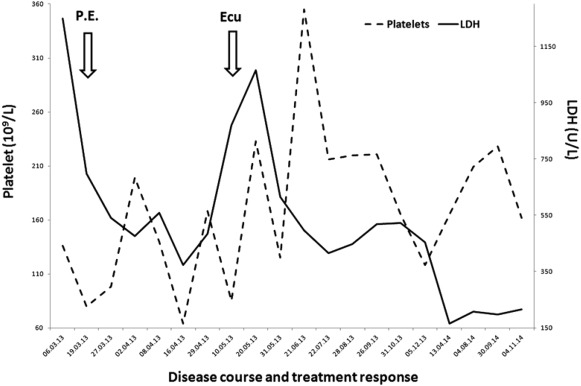
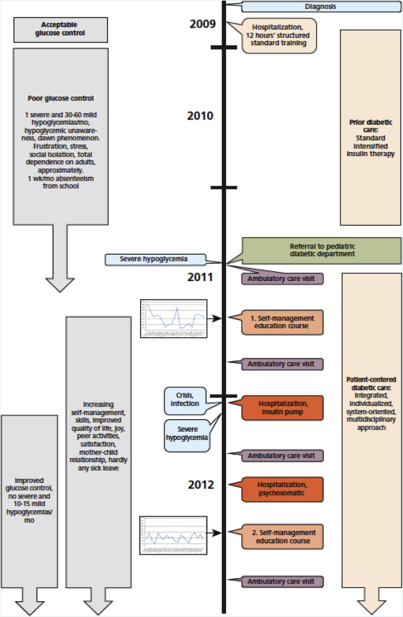

## What to write

Depict important date and times in this case (table or figure).

## Explanation

A timeline presents relevant events in the patient's history in chronological order in a figure or table and offers a succinct summary of one or more key events in the case, enabling the reader to readily view core elements of the case report. These core elements might include the following: a brief patient and family medical history; chief complaints; factors related to susceptibility; diagnostic evaluations; therapeutic interventions; care received from other clinicians; follow-up; and outcomes. In some cases, pictures may be incorporated into the timeline.

## Examples

: Disease course and treatment response. The timeline from presentation detailing platelet and lactate dehydrogenase (LDH) response to plasma exchange and eculizumab (Ecu). From _Plasma resistant atypical hemolytic uremic syndrome associated with a CFH mutation treated with eculizumab: a case report_[@ref35].

: Timeline of interventions and outcomes. From _Patient-centered diabetes care in children: an integrated, individualized, systems-oriented, and multidisciplinary approach_[@ref16].
