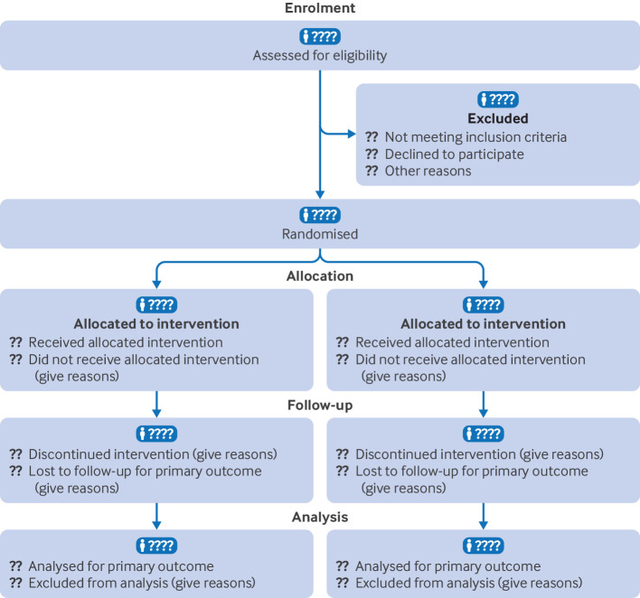

## What to write

For each group, the numbers of participants who were randomly assigned, received intended intervention, and were analysed for the primary outcome

## Examples

See @fig-1, @fig-2,
and @fig-3.

{#fig-1}

![Flow diagram of a multicentre trial of total (TKR) versus partial (PKR) knee replacement.[@ref421]](../uploads/hops081124.f2.jpg){#fig-2}

![Flow diagram of a multicentre trial of glucocorticoid intradiscal injection in patients with chronic low back pain.[@ref422] ESR=erythrocyte sedimentation rate; GC IDI=glucocorticoid intradiscal injection; MRI=magnetic resonance imaging](../uploads/hops081124.f3.jpg){#fig-3}

## Explanation

The design and conduct of some randomised trials are straightforward,
and the flow of participants, particularly where there are no losses to
follow-up or exclusions, through each phase of the study can be
described relatively easily. For other trials, it can be difficult for
readers to discern whether and why some participants did not receive the
treatment as allocated, were lost to follow-up, or were excluded from
the analysis.[@ref423] This information is crucial for several reasons.
Participants who were excluded after allocation are unlikely to be
representative of all participants in the study. For example,
participants may not be available for follow-up evaluation because they
experienced an acute exacerbation of their illness or harms of
treatment.[@ref271; @ref424]

Attrition as a result of loss to follow-up, which is often unavoidable,
needs to be distinguished from investigator-determined exclusion for
such reasons as ineligibility, withdrawal from treatment, and poor
adherence to the trial protocol. Erroneous conclusions can be reached if
participants are excluded from analysis, and imbalances in such
omissions between groups may be especially indicative of bias.[@ref424]
[@ref425; @ref426] Information about whether the investigators included
in the analysis all participants who underwent randomisation, in the
groups to which they were originally allocated (item 21b), is therefore
of particular importance. Knowing the number of participants who did not
receive the intervention as allocated or did not complete treatment
permits the reader to assess to what extent the estimated efficacy of
therapy might be underestimated in comparison with ideal circumstances.

If available, the number of people assessed for eligibility, and reason
for exclusion, should also be reported. Although this number is relevant
to external validity only and is arguably less important than the other
counts,[@ref427] it is a useful indicator of whether trial participants
were likely to be representative of all eligible participants.

A suggested template for reporting the number of participants who were
randomly assigned, received intended treatment, were lost to follow-up,
and were analysed for the primary outcome is shown in [figure
1](#f1){ref-type="fig"}, and the counts required are described in detail
in @tbl-7. A review of randomised trials
published in general medical journals found that reporting of what
happened to participants and their data was considerably more thorough
in articles that included a diagram of the flow of participants through
a trial than in those that did not.[@ref423]

  ------------------------------------------------------------------------------------------------------------------------------------------------------------------------------------------------------------------------------------------------------------------------------------------------------------------------------------------------------------------------------------------------------------------------
  Stage                  No of people included                                                            No of people not included or excluded                                                                      Rationale
  ---------------------- -------------------------------------------------------------------------------- ---------------------------------------------------------------------------------------------------------- -----------------------------------------------------------------------------------------------------------------------------------------------------------------------------------------------------
  Enrolment              People evaluated for potential enrolment                                         People who did not meet the inclusion criteria or met the inclusion criteria but declined to be enrolled   These counts indicate whether trial participants were likely to be representative of all patients seen; they are relevant to assessment of external validity only, and they are often not available

  Randomisation          Participants randomly assigned                                                   ---                                                                                                      Crucial count for defining trial size and assessing whether a trial has been analysed by intention-to-treat

  Treatment allocation   Participants who received intervention as allocated, by trial group              Participants who did not receive intervention as allocated, by trial group                                 Important counts for assessment of internal validity and interpretation of results; reasons for not receiving intervention as allocated should be given

  Follow-up              Participants who completed intervention as allocated, by trial group\            Participants who did not complete intervention as allocated, by trial group\                               Important counts for assessment of internal validity and interpretation of results; reasons for not completing intervention or follow-up should be given
                         Participants who completed follow-up as planned, by trial group                  Participants who did not complete follow-up as planned, by trial group                                     

  Analysis               Participants included in main analysis for the primary outcome, by trial group   Participants excluded from main analysis for the primary outcome, by trial group                           Crucial count for assessing whether a trial has been analysed by intention-to-treat; reasons for excluding participants should be given
  ------------------------------------------------------------------------------------------------------------------------------------------------------------------------------------------------------------------------------------------------------------------------------------------------------------------------------------------------------------------------------------------------------------------------
: Information required to document the flow of participants through each
stage of a randomised trial for the primary outcome {#tbl-7}

Some information, such as the number of individuals assessed for
eligibility, may not always be known,[@ref428] and depending on the
nature of a trial, some counts may be more relevant than others. It will
sometimes be useful or necessary to adapt the structure of the flow
diagram to a particular trial. In some situations, other information may
usefully be added. For example, for trials of non-pharmacological
interventions it may be important to report the number of care providers
or centres performing the intervention in each group and the number of
participants treated by each care provider or in each centre.[@ref22]

The exact form and content of the flow diagram may be varied according
to specific features of a trial. For example, many trials of surgery or
vaccination do not include the possibility of discontinuation. Although
CONSORT strongly recommends using a flow diagram to communicate
participant flow throughout the study, there is no specific, prescribed
format.