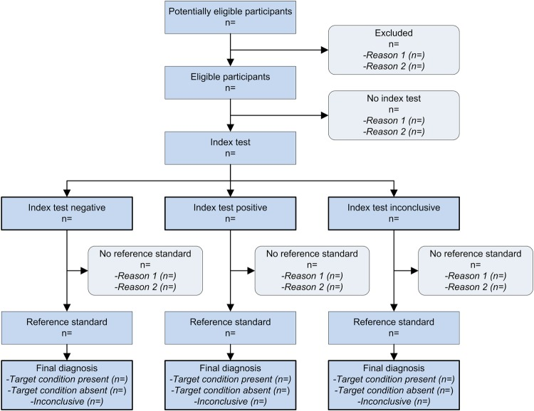

## What to write

Flow of participants, using a diagram.

## Explanation

Estimates of diagnostic accuracy may be biased if not
all eligible participants undergo the index test and the desired
reference standard.[@R80] This includes studies in which not all study
participants undergo the reference standard, as well as studies where
some of the participants receive a different reference standard.[@R70]
Incomplete verification by the reference standard occurs in up to 26% of
diagnostic studies; it is especially common when the reference standard
is an invasive procedure.[@R84]

To allow the readers to appreciate the potential for bias, authors are
invited to build a diagram to illustrate the flow of participants
through the study. Such a diagram also illustrates the basic structure
of the study. An example of a prototypical STARD flow diagram is
presented in @fig-f02.

{#fig-f02}

By providing the exact number of participants at each stage of the
study, including the number of true-positive, false-positive,
true-negative and false-negative index test results, the diagram also
helps identifying the correct denominator for calculating proportions
such as sensitivity and specificity. The diagram should also specify the
number of participants that were assessed for eligibility, the number of
participants who did not receive either the index test and/or the
reference standard and the reasons for that. This helps readers to judge
the risk of bias, but also the feasibility of the evaluated testing
strategy, and the applicability of the study findings.

*In the example*, the authors very briefly described the flow of
participants, and referred to a flow diagram in which the number of
participants and corresponding test results at each stage of the study
were provided, as well as detailed reasons for excluding participants
(@fig-f01).

## Example

> 'Between 1 June 2008 and 30 June 2011, 360 patients were
assessed for initial eligibility and invited to participate. The figure
shows the flow of patients through the study, along with the primary
outcome of advanced colorectal neoplasia. Patients who were excluded
(and reasons for this) or who withdrew from the study are noted. In
total, 229 patients completed the study, a completion rate of
64%'.[@R79] (See @fig-f01.)
>
> ![Example of flow diagram from a study evaluating the accuracy of faecal immunochemical testing for diagnosis of advanced colorectal neoplasia (adapted from Collins et al [@R79]).](../uploads/bmjopen2016012799f01.jpg){#fig-f01}
