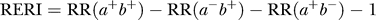

## What to write

Describe any methods used to examine subgroups and interactions.

## Explanation

As discussed in detail under [](), many debate the use and value of
analyses restricted to subgroups of the study population
[@pmed-0040297-b004; @pmed-0040297-b104]. Subgroup analyses are
nevertheless often done [@pmed-0040297-b004]. Readers need to know
which subgroup analyses were planned in advance, and which arose while
analysing the data. Also, it is important to explain what methods were
used to examine whether effects or associations differed across groups
(see []()).

Interaction relates to the situation when one factor modifies the effect
of another (therefore also called 'effect modification'). The joint
action of two factors can be characterized in two ways: on an additive
scale, in terms of risk differences; or on a multiplicative scale, in
terms of relative risk (see [](#interaction)
). Many authors and
readers may have their own preference about the way interactions should
be analysed. Still, they may be interested to know to what extent the
joint effect of exposures differs from the separate effects. There is
consensus that the additive scale, which uses absolute risks, is more
appropriate for public health and clinical decision making
[@pmed-0040297-b105]. Whatever view is taken, this should be clearly
presented to the reader, as is done in the example above
[@pmed-0040297-b103]. A lay-out presenting separate effects of both
exposures as well as their joint effect, each relative to no exposure,
might be most informative. It is presented in the example for
interaction under [](), and the calculations on the different scales
are explained [below](#interaction).

## Interaction (effect modification): the analysis of joint effects {#interaction}

Interaction exists when the association of an exposure with the risk of
disease differs in the presence of another exposure. One problem in
evaluating and reporting interactions is that the effect of an exposure
can be measured in two ways: as a relative risk (or rate ratio) or as a
risk difference (or rate difference). The use of the relative risk leads
to a multiplicative model, while the use of the risk difference
corresponds to an additive model
[@pmed-0040297-b187; @pmed-0040297-b188]. A distinction is
sometimes made between 'statistical interaction' which can be a
departure from either a multiplicative or additive model, and 'biologic
interaction' which is measured by departure from an additive model
[@pmed-0040297-b189]. However, neither additive nor multiplicative
models point to a particular biologic mechanism.

Regardless of the model choice, the main objective is to understand how
the joint effect of two exposures differs from their separate effects
(in the absence of the other exposure). The Human Genomic Epidemiology
Network (HuGENet) proposed a lay-out for transparent presentation of
separate and joint effects that permits evaluation of different types of
interaction [@pmed-0040297-b183]. Data from the study on oral
contraceptives and factor V Leiden mutation [@pmed-0040297-b182]
were used to explain the proposal, and this example is also used in item
17. Oral contraceptives and factor V Leiden mutation each increase the
risk of venous thrombosis; their separate and joint effects can be
calculated from the 2 by 4 table (see example 1 for []()) where the
odds ratio of 1 denotes the baseline of women without Factor V Leiden
who do not use oral contraceptives.

A difficulty is that some study designs, such as case-control studies,
and several statistical models, such as logistic or Cox regression
models, estimate relative risks (or rate ratios) and intrinsically lead
to multiplicative modelling. In these instances, relative risks can be
translated to an additive scale. In example 1 of [](), the separate
odds ratios are 3.7 and 6.9; the joint odds ratio is 34.7. When these
data are analysed under a multiplicative model, a joint odds ratio of
25.7 is expected (3.7 × 6.9). The observed joint effect of 34.7 is 1.4
times greater than expected on a multiplicative scale (34.7/25.7). This
quantity (1.4) is the odds ratio of the multiplicative interaction. It
would be equal to the antilog of the estimated interaction coefficient
from a logistic regression model. Under an additive model the joint odds
ratio is expected to be 9.6 (3.7 + 6.9 -- 1). The observed joint effect
departs strongly from additivity: the difference is 25.1 (34.7 -- 9.6).
When odds ratios are interpreted as relative risks (or rate ratios), the
latter quantity (25.1) is the Relative Excess Risk from Interaction
(RERI) [@pmed-0040297-b190]. This can be understood more easily when
imagining that the reference value (equivalent to OR=1) represents a
baseline incidence of venous thrombosis of, say, 1/10 000 women-years,
which then increases in the presence of separate and joint exposures.

## Examples

> "Sex differences in susceptibility to the 3 lifestyle-related risk
factors studied were explored by testing for biological interaction
according to Rothman: a new composite variable with 4 categories (*a*
^−^ *b* ^−^ *, a* ^−^ *b^+^, a^+^b* ^−^ *,* and *a^+^b^+^*) was
redefined for sex and a dichotomous exposure of interest where *a^−^*
and *b^−^* denote absence of exposure. RR was calculated for each
category after adjustment for age. An interaction effect is defined as
departure from additivity of absolute effects, and excess RR caused by
interaction (RERI) was calculated:
> 
> 
> 
> where RR(*a^+^b^+^*) denotes RR among those exposed to both factors
where RR(*a* ^−^ *b* ^−^) is used as reference category (RR = 1.0).
Ninety-five percent CIs were calculated as proposed by Hosmer and
Lemeshow. RERI of 0 means no interaction" [@pmed-0040297-b103].
