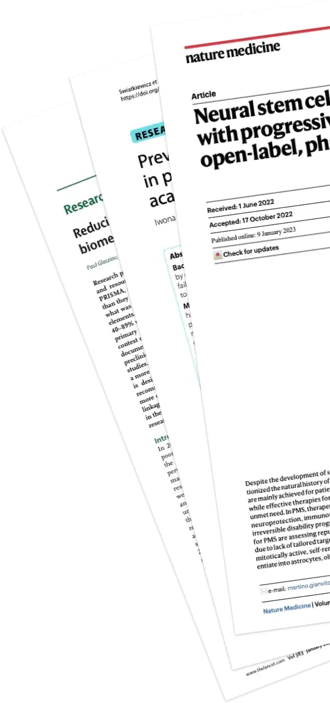

:::::::::::: quarto-title-block
::::::::::: quarto-title-banner-normal-margin
:::::::::: content-block
::::::::: hero-title-block
:::::::: grid
:::: {#cursor .g-col-lg-4 .g-col-md-3 .d-none .d-md-block}
::: top-banner-portrait

:::
::::

::::: {.g-col-lg-8 .g-col-md-9 .hero-content-center}
# Write research with clarity and confidence using **reporting guidelines**:

::: subtitle
community-created recommendations that ensure
[everyone]{#typewriter-words .emphasise}   can understand and use
your work.
:::

::: hero-buttons
[Search 700+ reporting
guidelines](reporting-guidelines/index.qmd){.btn-action-primary
.btn-action .btn-primary .btn .btn-lg .margin-right-1 role="button"}

[[›]{.chevron .modern-link} View popular reporting guidelines](#general-reporting-guidelines){.modern-link}

[[›]{.chevron} What are reporting guidelines?](#sec-what-are-rgs){.modern-link}

[[›]{.chevron} About The EQUATOR Network](#about-equator){.modern-link}
:::

<!-- hero buttons -->
:::::

<!-- g-col-lg-6-->
::::::::

<!-- grid -->
:::::::::

<!-- / hero-title-block -->
::::::::::

<!-- .content-block -->
:::::::::::

<!-- .quarto-title-banner-normal-margin -->
::::::::::::

<!-- Table of commonly used Reporting Guidelines -->
::: {.radial-background}

:::::::: {.content-block .center}

::::::: {.card-highlight style="margin-top: 2rem;"}

### General reporting guidelines {#general-reporting-guidelines}

[These reporting guidelines apply to general, common types of healthcare
research. Search our full database for more specific reporting
guidelines that may better fit your research.]{.lead}

:::::: {.table-block}
::: {style="text-align: left; margin: 3rem 0 2rem 0;"}

:::

[Search 700+ reporting guidelines](){.btn-action-primary .btn-action .btn-primary .btn .btn-lg .search-shortcut role="button" style="margin: 1rem 0 1rem 0;"}

:::: publisher-logos
Reporting guidelines are widely endorsed by leading medical journals,
including:

::: logos
   {.logo-smaller} 
:::

<!--/logos-->
::::

<!-- publisher-logos -->
::::::

<!-- card-highlight -->
:::::::

<!-- table-block -->
::::::::

:::
<!-- isometric background -->

::::::::::: {.content-block .center}
## Recommendations to help write up research clearly {#sec-what-are-rgs}

::: lead
Your research will be used by people from different disciplines and
backgrounds for decades to come. Reporting guidelines are
community-created recommendations for describing what you did and what
you found so that *everyone* can understand, repeat, apply, and
synthesise your work. Reporting guidelines make writing up research
easier, and transparent research leads to better patient outcomes.

:::

<!--end lead-->

::::::::: features
:::: feature
{.feature-icon}\

### Writing manuscripts

Write confidently using a reporting guideline to quickly turn a blank
page into a thorough and impactful manuscript.

::: learn-more
[Learn more »](about/reporting-guidelines.qmd#writing)
:::
::::

:::: feature
{.feature-icon}\

### Checking manuscripts

Use a reporting checklist to ensure you have included everything. Many
journals require completed checklists at submission.

::: learn-more
[Learn more »](about/reporting-guidelines.qmd#reporting-checklists)
:::
::::

:::: feature
{.feature-icon}\

### Writing applications

Reporting guidelines can help you write funding applications, ethics
applications, and protocols, but they won't make design decisions for
you!

::: learn-more
[Learn more »](about/reporting-guidelines.qmd#writing-applications)
:::
::::
:::::::::
:::::::::::

<!--/content-block-->

::::::::: radial-background

:::::::: {.content-block .center}
## Learn how and why people use reporting guidelines

::: lead
People around the world use reporting guidelines in many ways and for
many reasons.
:::

:::::: grid
::: {.g-col-md-4 .g-col-12 .card-highlight}
{.feature-photo}\

### Researchers

Both experienced and early career researchers use reporting guidelines
to write, learn, and teach.
:::

::: {.g-col-md-4 .g-col-12 .card-highlight}
{.feature-photo}\

### Editors

Editors from leading medical journals ask authors to use reporting
guidelines and check for adherence. \<!-- Read why editors from leading
medical journals ask authors to use reporting guidelines and how they
check adherence.
:::

::: {.g-col-md-4 .g-col-12 .card-highlight}
{.feature-photo}\

### Reviewers

Peer reviewers and evidence synthesisers use reporting guidelines to
judge the transparency of research and identify missing information.
:::

<!-- {.g-col-md-4 .g-col-12 .card-highlight} -->
::::::

<!--/grid -->
::::::::

<!-- /content-block -->
:::::::::

<!-- /alt-background -->

::::: {#about-equator .about-equator}
:::: content-block
## The EQUATOR Network

We are the leading global academic network dedicated to improving
research reporting quality.

EQUATOR stands for Enhancing the QUAlity and Transparency Of health
Research. Our mission is to improve the reliability and value of
published health research literature by promoting transparent and
accurate reporting and wider use of robust reporting guidelines.

We advance the work done by individual guideline development groups. We
maintain a database of reporting guidelines, run [training
courses](training.qmd) on how to write research articles, have resources
for
[publishers](https://www.equator-network.org/toolkits/using-guidelines-in-journals/),
[peer
reviewers](https://www.equator-network.org/toolkits/peer-reviewing-research/),
and reporting guideline
[developers](https://www.equator-network.org/toolkits/developing-a-reporting-guideline/).

We have centers in the
[UK](https://www.equator-network.org/about-us/uk-equator-centre/) (our
head office),
[Canada](https://www.equator-network.org/about-us/canadian-equator-centre/),
[Australia](https://www.equator-network.org/about-us/australasian-equator-centre/),
[France](https://www.equator-network.org/about-us/french-equator-centre/),
and [China](http://www.equator-chinese.org/pages/en/index/index.html).

::: logos
  {.logo-bigger}  {.logo-bigger}
:::

<!-- logos -->
::::

<!-- content-block -->
:::::

<!-- about-equator -->

:::::::: {#training .radial-background .training}

::: content-block
## Training

:::::: grid
:::: {.g-col-md-8 .g-col-12}
::: lead
Want to feel more confident when writing and publishing your research? Want to write quickly, clearly, and concisely?
:::

The UK EQUATOR Centre’s [Publication School]{.emphasise} is a hands-on
course designed for early-career researchers who want to take control of
the writing process and get their work out into the world.

[Learn more »](training.qmd)

<!-- lead -->
::::

<!-- .g-col-md-8 -->

::: {.g-col-md-4 .g-col-12}
{style="z-index: 1; position: relative;"}\
:::

<!-- .g-col-md-4 -->
::::::

<!-- .grid -->
:::::::

<!-- {.gradient-background-1 .training id=training} -->
::::::::

<!-- {.content-block} -->

::::: {#about-equator-uk .about-equator-uk}
:::: content-block
### The UK EQUATOR Centre

::: lead
The UK EQUATOR Centre is the headquarters of the EQUATOR Network.
:::
The UK Centre is run by Professor Gary Collins, based at Birmingham University, with collaboration from colleagues at the Nuffield Department of Orthopaedics, Rheumatology and
Musculoskeletal Sciences (NDORMS), University of Oxford. The UK EQUATOR
Centre maintains this website, a database of reporting guidelines, and
works with other organisations to promote transparent reporting and
other good research practices. Alongside clinical and meta-research, we
specialise in training researchers how to write.

#### UK EQUATOR Centre Staff

::: {#staff-listing}
:::

<!-- /staff listing -->
::::

<!-- {.about-equator-uk id=about-equator-uk} -->
:::::

<!-- {.content-block} -->

::::: alt-background
:::: get-started
::: content-block
### Ready to use a reporting guideline?

[Search reporting guidelines](){.btn-action-primary .btn-action
.btn-primary .btn .btn-lg .margin-right-1 .search-shortcut
role="button"}
:::
::::
:::::